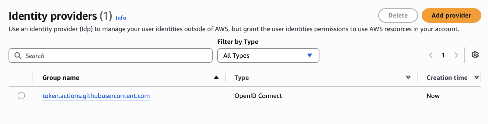
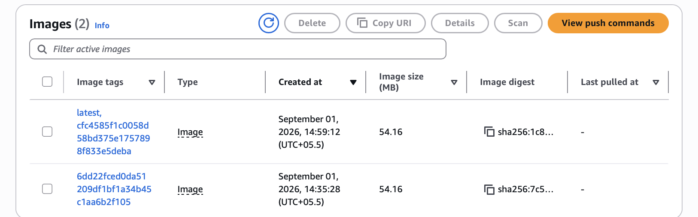
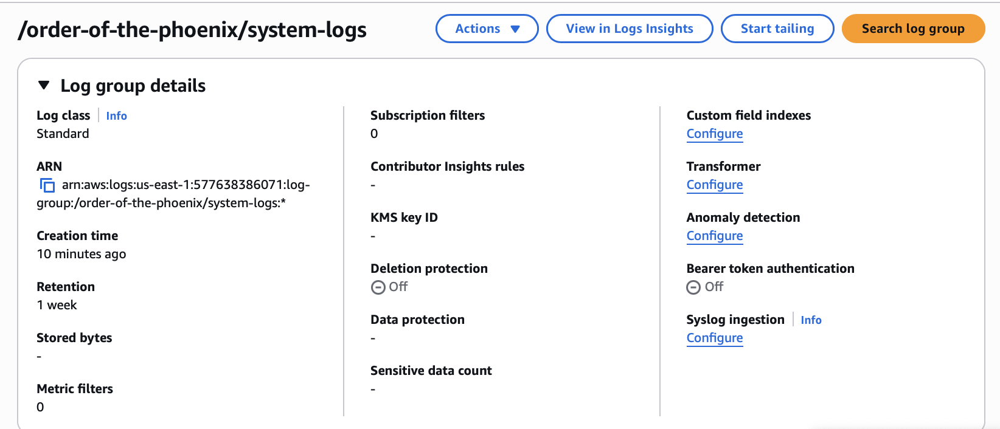
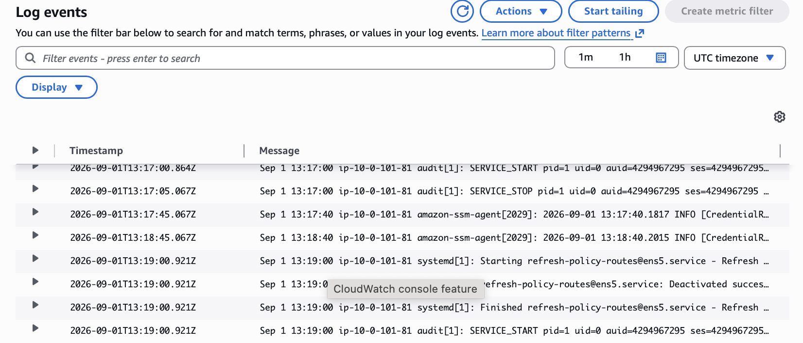
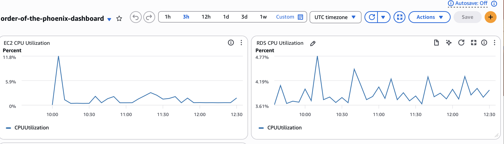
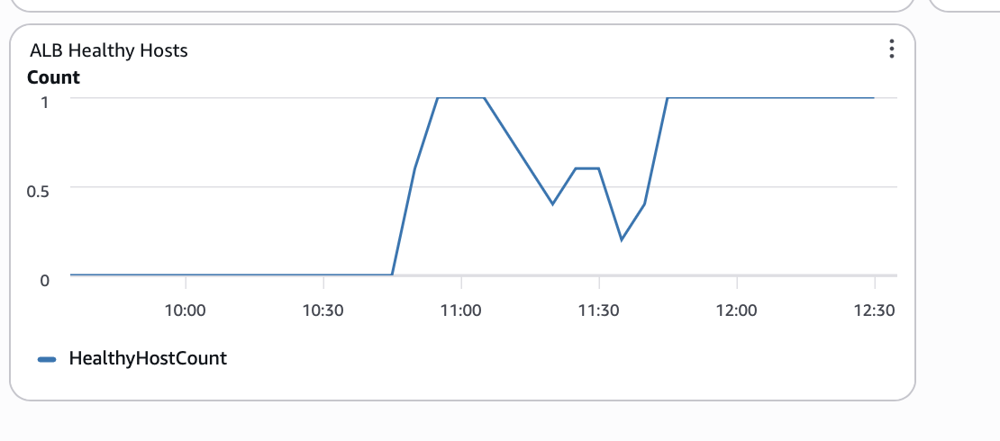
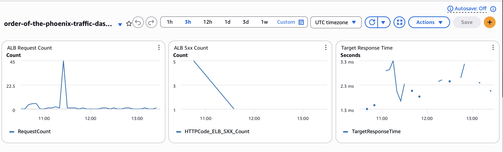
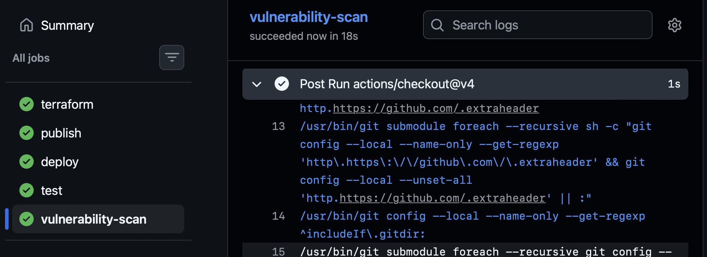

## What was Built

Phoenix application deployed using Terraform to AWS

### Setup Steps used to make app

```shell
mix archive.install hex phx_new
```

From parent dir:
```shell
mix phx.new order_of_the_phoenix
```

Needed to have postgres installed, up and running, with postgres user for next step
```shell
mix ecto.create
```

Running Steps Phoenix only covers above.

### Architecture Decisions

Reference repos used ECS for handling deployment. Instead I utilised one EC2 instance with a docker container for simpler setup.

No NAT Gateway, autoscaling, or blue-green deployment strategies are used.

### Structure

Flow is as follows -
```
Internet -> ALB -> EC2 Docker container -> private RDS PostgreSQL.
```
### Terraform

For Terraform, remote S3 is used to Manage State.

DynamoDB Table used to track locks.

### Security considerations

Mainly Github Actions variables and secrets used for environment variable configuration. Could have used AWS Services as well. Done for simpler setup.

Github Actions does not store AWS credentials. Created an identity provider in IAM called `token.actions.githubusercontent.com`. Github Actions creates identity tokens, which are validated by AWS.



Role created in IAM - AWS-Github-Role. This has a trust policy which checks if repository is SaachiKaup/order_of_the_phoenix.

Flow for GitHub Actions
    -> creates OIDC token
    -> sends token to AWS STS
    -> STS checks the IAM identity provider and role trust policy
    -> STS returns temporary AWS credentials
    -> Terraform / AWS CLI use those credentials

Role is also used during ECR setup. As in to push images to ECR. This was done for demo task. Ideally this should be a separate role with separate trust policies.

### Deployment Pipeline

- A push to main runs Terraform.
- The workflow builds a Docker image, pushes it to ECR with the commit SHA, and deploys it to EC2 through SSM.



- The ALB is checked after deployment.

### Monitoring

- Application and access logs go to CloudWatch Logs.
- System logs go to a separate CloudWatch log group.
- Dashboards show infrastructure health and ALB traffic.











### Testing and related Tradeoffs

- mix test and Trivy dependency scanning run in GitHub Actions.
- The setup uses one EC2 instance to keep cost and complexity low.
- Tests currently run after deployment, and ECR image scanning does not block deployment.



### Cost optimization measures

Since application is small, t3.micro EC2 instance and db.t3.micro RDS used. RDS automated backup retention is 7 days.

### Refs

1.Phoenix [Docs](https://phoenix.hexdocs.pm/1.8.13/testing.html#view-tests) for basic setup.

2.For Elixir, used this [project](https://github.com/danschultzer/elixir-terraform-aws-ecs-example). Utilises similar features. Was used primarily to structure repo.

3.Also used [this resource](https://xebia.com/blog/how-to-deploy-terraform-to-aws-with-github-actions-authenticated-with-openid-connect/) for IAM config etc.
